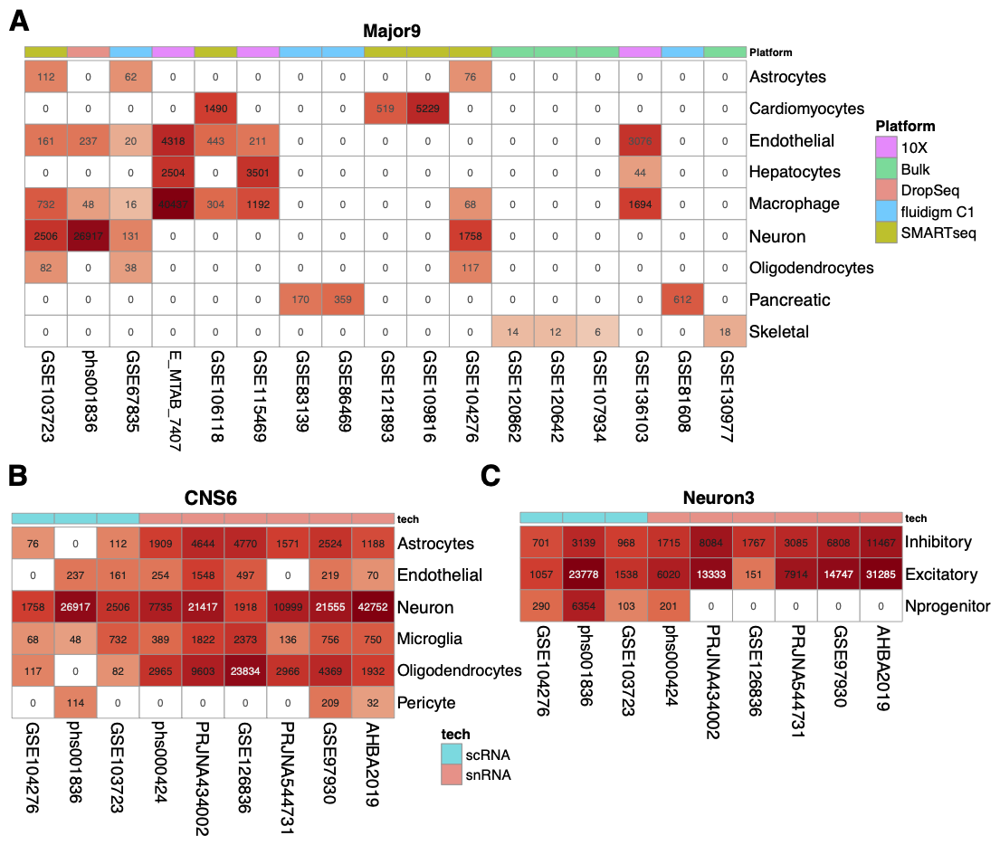
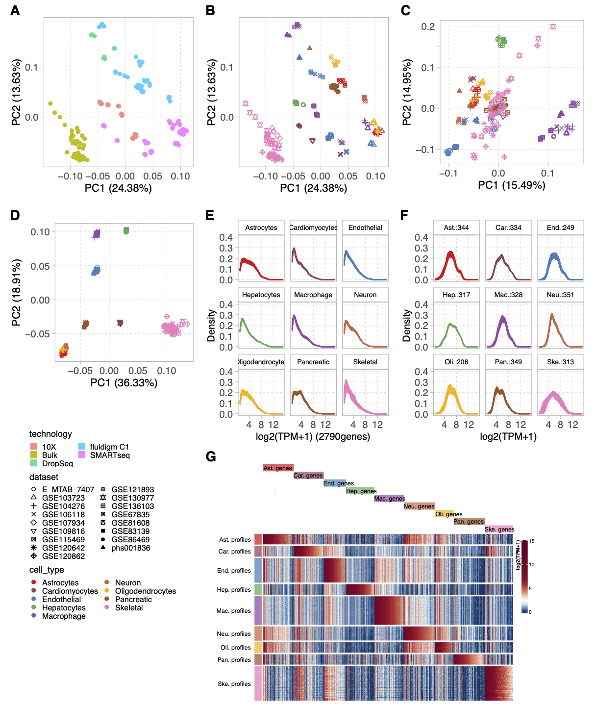
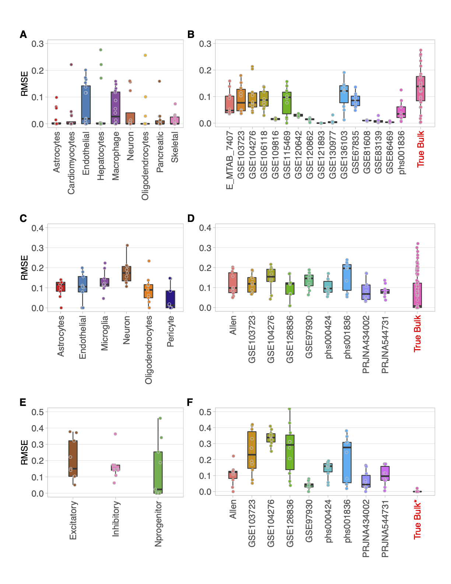
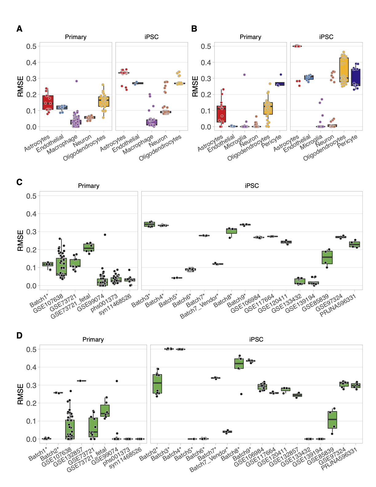
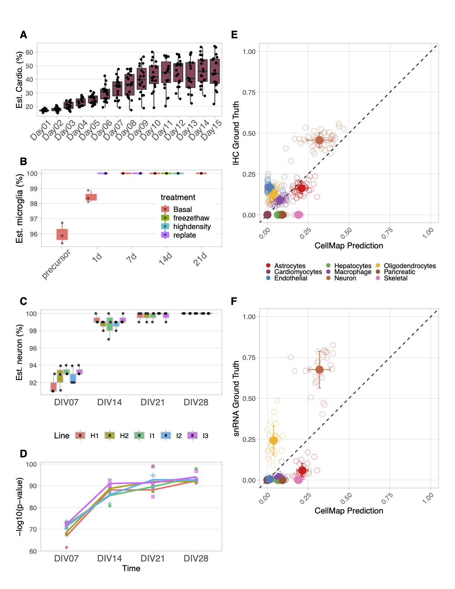
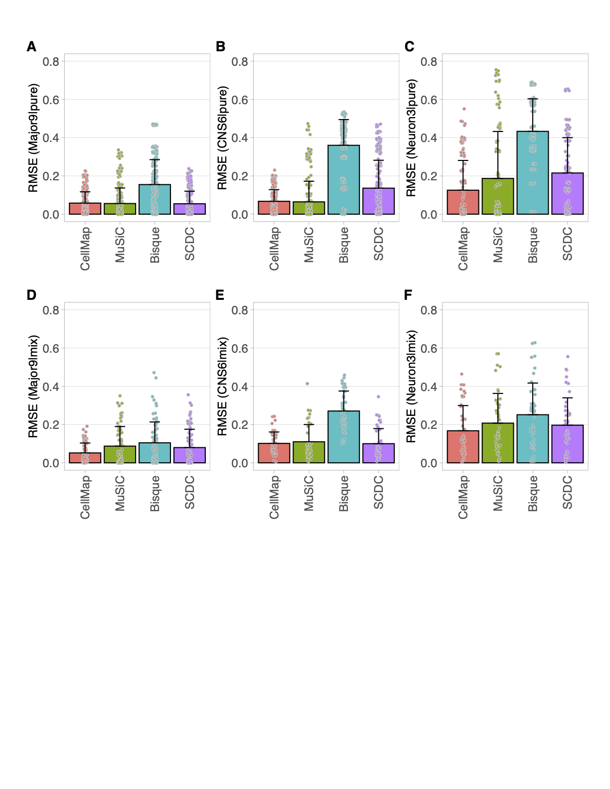
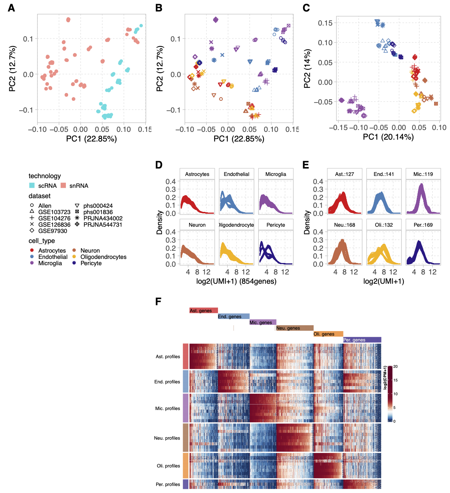
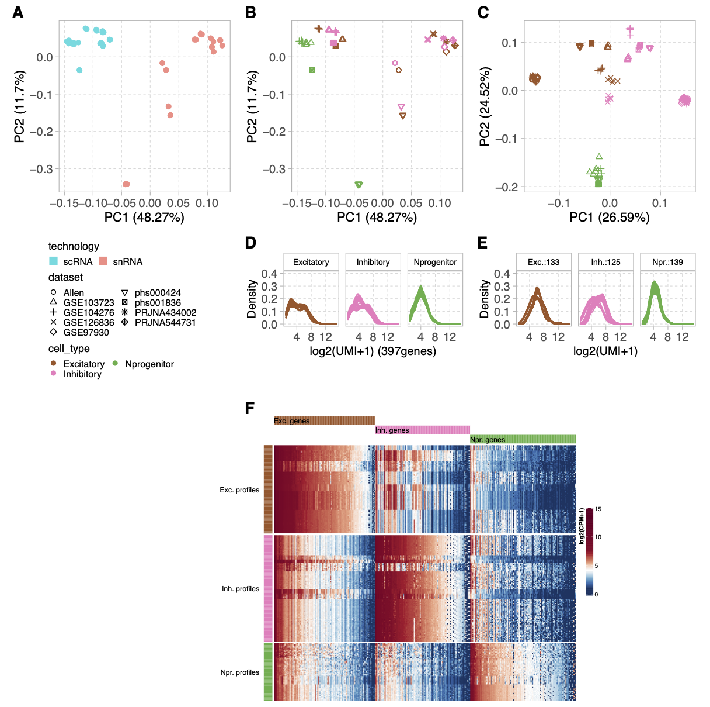
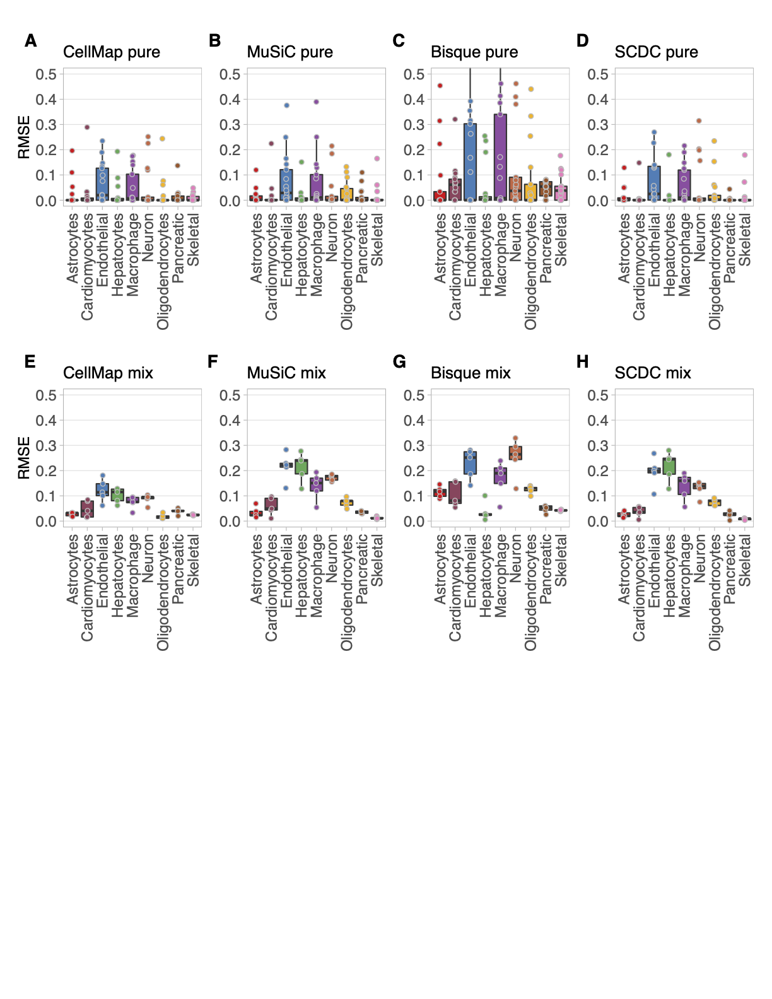
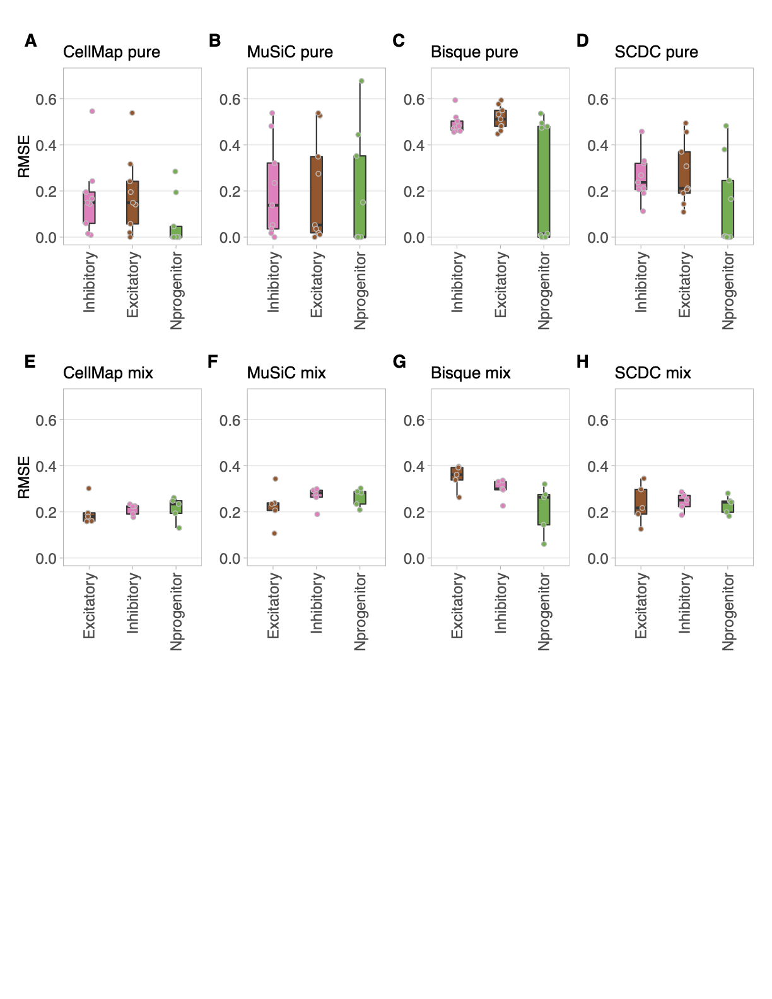

# CellMap

An R pacakge to estimate the cell type proportions of mixture bulk RNA based on pre-computed cell type profiles from sc/sn RNAseq data.

Three main functions are provided within the R package:

  - cellmap: Estimate the cell type proportions of mixture bulk expression based on pre-trained cell type profiles;
  - cellmapTraining: Obtain the cell type profiles of your interests from multiple sc/sn RNAseq datasets by a training process;
  - cellmapOne: Estimate the cell type proportions of mixture bulk based on one reference sc/sn RNAseq dataset.
  
**CellMap is intended to be used for research only and Biogen makes no representation or warranty as to the use or outcome of CellMap**

# Installation
```

# install the cellmap package
devtools::install_github('interactivereport/CellMap')

```

# Usage
**cellmap::cellmap**
```
> ?cellmap::cellmap
cellmap(
  strBulk,
  strProfile,
  strPrefix = substr(strBulk, 1, nchar(strBulk) - 4),
  delCT = NULL,
  cellCol = NULL,
  geneNameReady = FALSE,
  ensemblPath = "Data/",
  ensemblV = 97,
  bReturn = F,
  pCutoff = 0.05,
  core = 2
)

```
*Arguments*:
- strBulk: The full path to the query mixture bulk expression file.
Expression matrix separated by tabs with rows are genes, columns are samples.
First row includes the sample names or ids, while first column consists of gene symbols or gene ensembl id.
- strProfile: The full path to a pre-trained CellMap cell type profile.
The profile with ‘rds’ as file extension generated by ```cellMapTraining``` function.
- strPrefix: The prefix with path of the result files.
There are two files produced: a pdf file contains all cell type decomposition figures;
a tab separated table file including composition and p-values.
- delCT: Cell types should not be considered in the decomposition estimation.
A string with exact cell type names defined in the CellMap profile.
If more than one cell types needed to be removed, please separate them by commas (,). Default is ```NULL```.
- cellCol: R colors for all cell types. A named vector of R colors, where names are cell type names.
Default is ```NULL```, which means ```$para$cellCol``` from the provided CellMap profile will be used.
- geneNameReady: A boolean to indicate if the gene names in the query mixture bulk expression matrix is official symbol already.
The ```FALSE``` option also works with the official symbol is used in the expression matrix.
Default is ```FALSE```, which enable to find official symbol by an R package called ```biomaRt```.
- ensemblPath: The path to a folder where ensembl gene definition is/will be saved.
The ensembl gene definition file will be saved if it never run before.
Default is **Data** in the current working directory.
- ensemblV: The version of the ensembl to be used for the input query bulk expression. Default is 97.
- bReturn: A Boolean indicate if return object is needed.
```False```, no object returned but plots in a pdf as well as a tables in a tsv file.
```True```, return an R list object including details of raw decomposition results without generating any file.
- core: The number of computation nodes could be used. Default is 2.
- bCutoff: A numeric indicate the significant level. Default is 0.05.


```
> ?cellmap::cellmapTraining
> ?cellmap::cellmapOne
```

}

}
\value{
If \code{bReturn} is set to be \code{TRUE}, a named list object with detailed decomposition results is returned.
The following objects are in the list, and they can be accessed by ($) of the returned list object:
\itemize{
\item \code{compoP} A matrix of the raw fitting coefficient for each sample (column) and each cell type (row).
It needed to normalize the sum of each column to be 1, in order to martch the output compisition table.
\item \code{compoP} A matrix of the fitting p-values for each sample (column) and each cell type (row).
\item \code{overallP} A vector of the overall fitting p-value for each sample.
\item \code{rmse} A vector of the fitting RMSE for each sample.
\item \code{coverR} A numeric indicate the ratio of cell type signature genes covered in the mixture bulk expression data
\item \code{rawComp} A named list of all raw composition matrix, p-values, RMSE for each sample.
\item \code{rawSets} A matrix of all sets of pure cell type combinations.
\item \code{missingF} A vector of cell type signature genes which are not in the query bulk expresion data.
\item \code{missingByCellType} A named list of cell type signature genes which are not in the query bulk expresion data for each cell type.
}
}
\description{
This function estimates cell type proportions of mixture bulk RNA samples based on pre-trained cell type profiles.
}
\examples{
strMix <- system.file("extdata","bulk.txt",package="cellmap")
strProfile <- system.file("extdata","CNS6.rds",package="cellmap")
cellmap(strMix,strProfile,strPrefix="~/cellmap_CNS6_test")

}


# Pre-build profiles
There are a few pre-build profiles:
  - Major9: Astrocytes, Cardiomyocytes, Endothelial, Hepatocytes, Macrophage, Neuron, Oligodendrocytes, Pancreatic, Skeletal
  - CNS6: Astrocytes, Endothelial, Neuron, Microglia, Oligodendrocytes, Pericyte
  - Neuron3: Inhibitory, Excitatory, Nprogenitor
  - NGN2: iPSC, DAY3, DIV7, DIV7after

Due to the file sizes, all profiles are not installed with the CellMap R package. You can obtain those profiles by either directly downloading from the 'profiles' folder above or executing below commands on linux (the same for Windows/Mac OS) after installation of the CellMap R package:
```

git clone https://github.com/interactivereport/CellMap.git
cd CellMap
./cpProfile.R

```

# manuscript
The manuscript folder contains the modifid version of [***MuSiC***](https://github.com/xuranw/MuSiC), [***SCDC***](https://github.com/meichendong/SCDC) and [***Bisque***](https://github.com/cozygene/bisque), to generate similar output format to the cellmap for comparison/evaluation purpose, as well as parallel implementation of those methods.

## manuscript Figures

### Figure 2
[script](manuscript/Fig/Fig2.R)  
[pdf](manuscript/Fig/Fig2.pdf)  
[png](manuscript/Fig/Fig2.png)  



### Figure 3
[script](manuscript/Fig/Fig3.R)  
[pdf](manuscript/Fig/Fig3.pdf)  
[png](manuscript/Fig/Fig3.png)  



### profile heatmap
[script](manuscript/Fig/Fig.profile.heatmap.R)  
[pdf](manuscript/Fig/Fig3.profile.heatmap.pdf)  

### Figure 4
[script](manuscript/Fig/Fig4.R)  
[pdf](manuscript/Fig/Fig4.pdf)  
[png](manuscript/Fig/Fig4.png)  



### Figure 5
[script](manuscript/Fig/Fig5.R)  
[pdf](manuscript/Fig/Fig5.pdf)  
[png](manuscript/Fig/Fig5.png)  



### Figure 6
[script](manuscript/Fig/Fig6.R)  
[pdf](manuscript/Fig/Fig6.pdf)  
[png](manuscript/Fig/Fig6.png)  



### Figure 7
[script](manuscript/Fig/Fig7.R)  
[pdf](manuscript/Fig/Fig7.pdf)  
[png](manuscript/Fig/Fig7.png)  



### Supplemental Figure 1
[script](manuscript/Fig/S1.2.R)  
[pdf](manuscript/Fig/Fig1.pdf)  
[png](manuscript/Fig/Fig1.png)  



### Supplemental Figure 2
[script](manuscript/Fig/S1.2.R)  
[pdf](manuscript/Fig/Fig2.pdf)  
[png](manuscript/Fig/Fig2.png)  



### Supplemental Figure 3
[script](manuscript/Fig/S3.4.5.R)  
[pdf](manuscript/Fig/S3.pdf)  
[png](manuscript/Fig/S3.png)  



### Supplemental Figure 4
[script](manuscript/Fig/S3.4.5.R)  
[pdf](manuscript/Fig/S4.pdf)  
[png](manuscript/Fig/S4.png)  


### Supplemental Figure 5
[script](manuscript/Fig/S3.4.5.R)  
[pdf](manuscript/Fig/S5.pdf)  
[png](manuscript/Fig/S5.png)  




