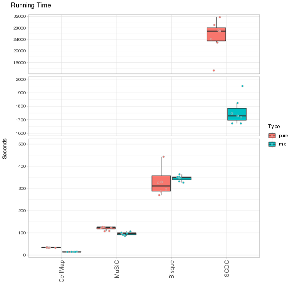
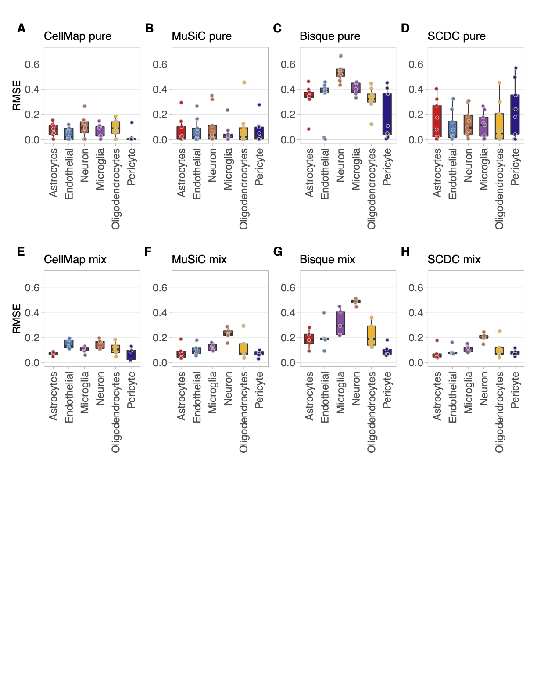

# CellMap

An R pacakge to estimate the cell type proportions of mixture bulk RNA based on pre-computed cell type profiles from sc/sn RNAseq data.

Three main functions are provided within the R package:

  - cellmap: Estimate the cell type proportions of mixture bulk expression based on pre-trained cell type profiles;
  - cellmapTraining: Obtain the cell type profiles of your interests from multiple sc/sn RNAseq datasets by a training process;
  - cellmapOne: Estimate the cell type proportions of mixture bulk based on one reference sc/sn RNAseq dataset.
  
**CellMap is intended to be used for research only and Biogen makes no representation or warranty as to the use or outcome of CellMap**
**Citation: Ouyang, Z., Bourgeois-Tchir, N., Lyashenko, E. et al. Characterizing the composition of iPSC derived cells from bulk transcriptomics data with CellMap. Sci Rep 12, 17394 (2022). https://doi.org/10.1038/s41598-022-22115-1**

# Installation
```

# install the cellmap package
devtools::install_github('interactivereport/CellMap')

```

# Usage
**cellmap::cellmap**

This function estimates cell type proportions of mixture bulk RNA samples based on pre-trained cell type profiles.
```
> ?cellmap::cellmap
cellmap(
  strBulk,
  strProfile,
  strPrefix = substr(strBulk, 1, nchar(strBulk) - 4),
  delCT = NULL,
  cellCol = NULL,
  geneNameReady = FALSE,
  ensemblPath = "Data/",
  ensemblV = 97,
  bReturn = F,
  pCutoff = 0.05,
  core = 2
)

```
*Arguments*:
- strBulk: The full path to the query mixture bulk expression file.
Expression matrix separated by tabs with rows are genes, columns are samples.
First row includes the sample names or ids, while first column consists of gene symbols or gene ensembl id.
- strProfile: The full path to a pre-trained CellMap cell type profile.
The profile with ‘rds’ as file extension generated by ```cellMapTraining``` function.
- strPrefix: The prefix with path of the result files.
There are two files produced: a pdf file contains all cell type decomposition figures;
a tab separated table file including composition and p-values.
- delCT: Cell types should not be considered in the decomposition estimation.
A string with exact cell type names defined in the CellMap profile.
If more than one cell types needed to be removed, please separate them by commas (,). Default is ```NULL```.
- cellCol: R colors for all cell types. A named vector of R colors, where names are cell type names.
Default is ```NULL```, which means ```$para$cellCol``` from the provided CellMap profile will be used.
- geneNameReady: A boolean to indicate if the gene names in the query mixture bulk expression matrix is official symbol already.
The ```FALSE``` option also works with the official symbol is used in the expression matrix.
Default is ```FALSE```, which enable to find official symbol by an R package called ```biomaRt```.
- ensemblPath: The path to a folder where ensembl gene definition is/will be saved.
The ensembl gene definition file will be saved if it never run before.
Default is **Data** in the current working directory.
- ensemblV: The version of the ensembl to be used for the input query bulk expression. Default is 97.
- bReturn: A Boolean indicate if return object is needed.
```False```, no object returned but plots in a pdf as well as a tables in a tsv file.
```True```, return an R list object including details of raw decomposition results without generating any file.
- core: The number of computation nodes could be used. Default is 2.
- bCutoff: A numeric indicate the significant level. Default is 0.05.

*Return*

If ```bReturn``` is set to be ```TRUE```, a named list object with detailed decomposition results is returned.
The following objects are in the list, and they can be accessed by ($) of the returned list object:
- ```compoP``` A matrix of the raw fitting coefficient for each sample (column) and each cell type (row).
It needed to normalize the sum of each column to be 1, in order to martch the output compisition table.
- ```compoP``` A matrix of the fitting p-values for each sample (column) and each cell type (row).
- ```overallP``` A vector of the overall fitting p-value for each sample.
- ```rmse``` A vector of the fitting RMSE for each sample.
- ```coverR``` A numeric indicate the ratio of cell type signature genes covered in the mixture bulk expression data
- ```rawComp``` A named list of all raw composition matrix, p-values, RMSE for each sample.
- ```rawSets``` A matrix of all sets of pure cell type combinations.
- ```missingF``` A vector of cell type signature genes which are not in the query bulk expresion data.
- ```missingByCellType``` A named list of cell type signature genes which are not in the query bulk expresion data for each cell type.

*Examples*
```
strMix <- system.file("extdata","bulk.txt",package="cellmap")
strProfile <- system.file("extdata","CNS6.rds",package="cellmap")
cellmap(strMix,strProfile,strPrefix="~/cellmap_CNS6_test")
```

**cellmap::cellmapTraining**

This function creates a cellmap profile include specified cell types from a set of sc/sn RNAseq data.
The TPM of full length or counts of 3’end sc/sn RNAseq data is recommended.
```
> ?cellmap::cellmapTraining
cellmapTraining(
  strData,
  strPrefix,
  cellTypeMap = NULL,
  cellCol = NULL,
  modelForm = "log2",
  DEGmethod = "edgeR",
  batchMethod = "Full",
  sampleN = 5,
  seqDepth = 2e+06,
  normDepth = 1e+06,
  geneCutoffCPM = 4,
  geneCutoffDetectionRatio = 0.8,
  selFeatureN = 100,
  DEGlogFCcut = 1,
  DEGqvalcut = 0.05,
  DEGbasemeancut = 16,
  mixN = 10,
  setN = 1000,
  topN = 50,
  strBulk = "",
  strRate = "",
  geneNameReady = F,
  ensemblPath = "Data/",
  ensemblV = 97,
  rmseCutoff = 0.1,
  tailR = 0.8,
  maxRMrate = 0.75,
  maxIteration = 30,
  core = 2
)
```
*Arguments*
- strData: A vector of paths to the expression matrix of all sc/sn RNAseq datasets (.rds).
Each expression matrix with rows are genes (official gene symbol is required as first column);
and columns are cells with cell type and data set information encoded in to the column names (cellType|dataset|…).

- strPrefix: A string indicates the prefix with path of the result files.
There are three files produced: two PDF files contains figures of the profile quality as well as
performance on pseudo mixture and input bulk if provided;
and an RDS file contains the profile which can be provided to cellmap function.

- cellTypeMap: A named vector indicates the cell types of the profile which the cellmap needed to train for.
The names of the vector are the cell type names defined in the column names from expression matrix of RDS files,
while the values are the cell type will be used in the final profile.
For instance, many Exhibitory and Inhibitory cells are both defined in the data,
while the neuron is one of the interested cell types.
Thus, we can create a vector c(Exhibitory=Neuron, Inhibitory=Neuron) to
let the cellmap know all Exhibitory and Inhibitory cells are now called Neuron.
If NULL, all cell types defined in the data matrix will be used as original name.
Please note that: Neuron and Neurons will be considered different cell types. Default is NULL.

- cellCol: A named vector indicate the color of the cell types.
The names of the vector are the cell type names while the value are R-color, “#FFFFFF” is preferred.
If NULL, colors will be assigned to each of cell types. Default is NULL.

- modelForm: ‘linear’ or ‘log2’ for the profile model.
log2 is preferred since some genes might have dominant expression values which will bias towards those genes.
Default is log2.

- DEGmethod: One from ‘edgeR’, ‘DESeq2’, ‘voom’ or ‘Top’ can be chosen.
This indicates the method for identifying the cell type signature genes. Default is edgeR.

- batchMethod: One from ‘Full’, ‘Partial’, ‘Separate’ or ‘None’ can be chosen.
This indicates the method for batch removal. (Please check the publication for details.)
In short, if the cell types of interested are mostly overlapped among datasets, ‘Full’ is preferred,
while ‘Separate’ is for minimal overlap. Default is ‘Full’.

- sampleN: A numeric indicates the number of pseudo pure samples to be generated for each cell type from each dataset.
Default is 5.

- seqDepth: A numeric indicates the total measurements (counts) for a pseudo pure sample.
Default is 2M.

- normDepth: A numeric indicates the sequence depth to normalize the pseudo pure samples, such as CPM.
Default is 1M.

- geneCutoffCPM: A numeric indicates the minimal normalized expression of a gene to be considered.
Default is 4.

- geneCutoffDetectionRatio: A numeric indicates the minimal ratio of data sets where a gene expressed for a cell type.
Default is 0.8.

- selFeatureN: A numeric indicates the maximin number of signature genes for each cell type in an iteration.
Default is 100.

- DEGlogFCcut: A numeric indicates the minimal log fold change for a gene to be considered signature. Default is 1.

- DEGqvalcut: A numeric indicates the maximin FDR for a gene to be considered signature. Default is 0.05.

- DEGbasemeancut: A numeric indicates the minimal average expression for ‘DESeq2’, ‘voom’ or ‘Top’ methods. Default is 16.

- mixN: A numeric indicates the number of pseudo mixture to be generated for each dataset during pseudo training process.
Default is 10.

- setN: A numeric indicates the number of random combinations of pseudo pure sample during pseudo training process
for each iteration. Default is 1000.

- topN: A numeric indicates the number of the top performing (based on RMSE) combinations of pseudo pure samples
for each pseudo mixture are kept during the pseudo training. Default is 50.

- strBulk: The path to the expression matrix with known cell type compositions.
Expression matrix is tab separated with genes in rows, samples in columns. Default is ‘’.

- strRate: The path to the cell type compositions of the above expression matrix.
The composition matrix is tab separated with cell types in rows, samples in columns. Default is ‘’.

- geneNameReady: A boolean to indicate if the gene names in the above bulk expression
matrix is official symbol already. The ```FALSE``` option also works with the official symbol is
used in the expression matrix. Default is ```FALSE```, which enable to find official symbol by
an R package called ```biomaRt```. Default is ```FALSE```.

- ensemblPath: The path to a folder where ensembl gene definition is/will be saved.
The ensembl gene definition file will be saved if it never run before.
Default is *Data/* in the current working directory.

- ensemblV: The version of the ensembl to be used for the input query bulk expression. Default is 97.

- rmseCutoff: A numeric indicates the maximin RMSE for a bulk sample.
All cell types from those bulk samples whose RMSE is larger than this value will be included in
the next iteration training. Default is 0.1.

- maxRMrate: The maximin ratio of total pseudo pure combinations to be removed during bulk
training process. Default is 0.75.

- maxIteration: The maximin iterations.
If the RMSE for all bulk samples are less than indicated rmseCutoff,
the iteration will stopped. Default is 10.

- core: The number of computation nodes could be used. Default is 2.

- trailR: The maximin ratio of pseudo pure combinations to be removed for each bulk sample during
bulk training process. Default is 0.8.

*Examples*
```
strData <- c(system.file("extdata","GSE103723.rds",package="cellmap"),
  system.file("extdata","GSE104276.rds",package="cellmap"))
cellTypeMap <- c(Macrophage=Microglia,Astrocytes=Astrocytes,Oligodendrocytes=Oligodendrocytes,
  GABAergic=Neuron,Glutamatergic=Neuron,Excitatory=Neuron,Inhibitory=Neuron)
cellmapTraining(strData,strPrefix="~/cellmap_profile",cellTypeMap,core=16)
```

# Running time
The running time for deconvolute 220 *pure* samples (single cell type) and 80 *mix* samples on a 32 core cluster is demonstrated below. In short: it only tooks around 15 seconds for 80 samples, while 34 secondes for 220 samples based on Major9 profiles. And it costs about 24 hours to generated the Major9 profile with 10 iterations from 17 datasets, while 4.25 hours for CNS6 and 2.34 hours for Neuron3. The running time depends on the numbers of datasets, cell types, bulk samples.


# Pre-build profiles
There are a few pre-build profiles:
  - Major9: Astrocytes, Cardiomyocytes, Endothelial, Hepatocytes, Macrophage, Neuron, Oligodendrocytes, Pancreatic, Skeletal
  - CNS6: Astrocytes, Endothelial, Neuron, Microglia, Oligodendrocytes, Pericyte
  - Neuron3: Inhibitory, Excitatory, Nprogenitor
  - NGN2: iPSC, DAY3, DIV7, DIV7after

Due to the file sizes, all profiles are not installed with the CellMap R package. You can obtain those profiles by either directly downloading from the 'profiles' folder above or executing below commands on linux (the same for Windows/Mac OS) after installation of the CellMap R package:
```
git clone https://github.com/interactivereport/CellMap.git
cd CellMap
./cpProfile.R

```

# Profile structure
The profile object from the training is stored as an *rds* format.
```
> CNS6 <- readRDS("CNS6.rds")
> names(CNS6)
[1] "expr"  "selG"  "sets"  "para"  "score"
> dim(CNS6$expr)
[1] 12064  1534
> head(colnames(CNS6$expr))
[1] "Neuron|GSE104276|1|iter1"     "Neuron|GSE104276|2|iter1"
[3] "Neuron|GSE104276|3|iter1"     "Neuron|GSE104276|4|iter1"
[5] "Neuron|GSE104276|5|iter1"     "Astrocytes|GSE104276|1|iter1"
> dim(CNS6$sets)
[1] 5318    6
> names(CNS6$selG)
[1] "Astrocytes"       "Endothelial"      "Microglia"        "Neuron"
[5] "Oligodendrocytes" "Pericyte"
>  head(CNS6$selG$Astrocytes)
[1] "SLCO1C1"  "SLC39A12" "MRVI1"    "FAM189A2" "F3"       "AQP4"
```
A list with 5 variables (*expr*, *selG*, *sets*,*para* and *score*) are saved in the profile object.
- *expr* is the normalized expression matrix with genes as rows and pure cell type as columns. 
The cell type identifier is at the beining of the column names separated by '|'.
- *sets* is the pre-trained profile combinations, each row is a combination, and each column is a cell type.
- *selG* is the pre-selected feature genes for each cell type.
- *para* is the parameters used to generate the profiles.
- *score* is a numberic indicated the score obtained in the training, the smaller the better.

# manuscript
The manuscript folder contains the modifid version of [***MuSiC***](https://github.com/xuranw/MuSiC), [***SCDC***](https://github.com/meichendong/SCDC) and [***Bisque***](https://github.com/cozygene/bisque), to generate similar output format to the cellmap for comparison/evaluation purpose, as well as parallel implementation of those methods.

## manuscript Figures

### Figure 2
[script](manuscript/Fig/Fig2.R)  
[pdf](manuscript/Fig/Fig2.pdf)  
[png](manuscript/Fig/Fig2.png)  


### Figure 3
[script](manuscript/Fig/Fig3.R)  
[pdf](manuscript/Fig/Fig3.pdf)  
[png](manuscript/Fig/Fig3.png)  


### profile heatmap
[script](manuscript/Fig/Fig.profile.heatmap.R)  
[pdf](manuscript/Fig/Fig3.profile.heatmap.pdf)  

### Figure 4
[script](manuscript/Fig/Fig4.R)  
[pdf](manuscript/Fig/Fig4.pdf)  
[png](manuscript/Fig/Fig4.png)  


### Figure 5
[script](manuscript/Fig/Fig5.R)  
[pdf](manuscript/Fig/Fig5.pdf)  
[png](manuscript/Fig/Fig5.png)  


### Figure 6
[script](manuscript/Fig/Fig6.R)  
[pdf](manuscript/Fig/Fig6.pdf)  
[png](manuscript/Fig/Fig6.png)  


### Figure 7
[script](manuscript/Fig/Fig7.R)  
[pdf](manuscript/Fig/Fig7.pdf)  
[png](manuscript/Fig/Fig7.png)  


### Supplemental Figure 1
[script](manuscript/Fig/S1.2.R)  
[pdf](manuscript/Fig/Fig1.pdf)  
[png](manuscript/Fig/Fig1.png)  


### Supplemental Figure 2
[script](manuscript/Fig/S1.2.R)  
[pdf](manuscript/Fig/Fig2.pdf)  
[png](manuscript/Fig/Fig2.png)  


### Supplemental Figure 3
[script](manuscript/Fig/S3.4.5.R)  
[pdf](manuscript/Fig/S3.pdf)  
[png](manuscript/Fig/S3.png)  


### Supplemental Figure 4
[script](manuscript/Fig/S3.4.5.R)  
[pdf](manuscript/Fig/S4.pdf)  
[png](manuscript/Fig/S4.png)  



### Supplemental Figure 5
[script](manuscript/Fig/S3.4.5.R)  
[pdf](manuscript/Fig/S5.pdf)  
[png](manuscript/Fig/S5.png)  


